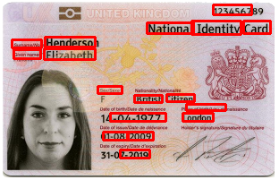

mocr
======

.. image:: https://img.shields.io/pypi/v/mocr.svg
    :target: https://pypi.org/pypi/mocr/

.. image:: https://img.shields.io/pypi/pyversions/mocr.svg
    :target: https://pypi.org/project/mocr

.. image:: https://travis-ci.org/verifid/mocr.svg?branch=master
    :target: https://travis-ci.org/verifid/mocr

.. image:: https://codecov.io/gh/verifid/mocr/branch/master/graph/badge.svg
    :target: https://codecov.io/gh/verifid/mocr

Meaningful Optical Character Recognition from identity cards with Deep Learning.

Introduction
============

**mocr** is a library that can be used to detect meaningful optical characters from identity cards. Code base is pure ``Python`` and
works with 2.7 and most of the 3.x versions. It has some low level dependencies such as ``Tesseract``. **mocr** uses a pre-trained east
detector with OpenCV and applies it's Deep Learning techniques.

It has a pre-trained east detector inside the module and a custom trained model can be given as a parameter.

Prerequisites
=============

* `Tessaract <https://github.com/tesseract-ocr/tesseract>`_ must be installed on your computer before using OCR. Please check `installation link <https://github.com/tesseract-ocr/tesseract#installing-tesseract>`_ for details.
* The other dependencies are listed on ``requirements.txt`` and will be installed when you install with pip.

Installation
============

**From source**

Install module using `pip`::

    $ pip install mocr

Download the latest `mocr` library from: https://github.com/verifid/mocr

Install module using `pip`::

    $ pip install -e .

Extract the source distribution and run::

    $ python setup.py build
    $ python setup.py install

Running Tests
=============

The test suite can be run against a single Python version which requires ``pip install pytest`` and optionally ``pip install pytest-cov`` (these are included if you have installed dependencies from ``requirements.testing.txt``)

To run the unit tests with a single Python version::

    $ py.test -v

to also run code coverage::

    $ py.test -v --cov-report html --cov=mocr

To run the unit tests against a set of Python versions::

    $ tox

Sample Usage
============

Initiating the ``TextRecognizer`` with identity image and then finding the texts with their frames::

    import os
    from mocr import TextRecognizer

    image_path = os.path.join('tests', 'data/sample_uk_identity_card.png')
    east_path = os.path.join('mocr', 'model/frozen_east_text_detection.pb')

    text_recognizer = TextRecognizer(image_path, east_path)
    (image, _, _) = text_recognizer.load_image()
    (resized_image, ratio_height, ratio_width, _, _) = text_recognizer.resize_image(image, 320, 320)
    (scores, geometry) = text_recognizer.geometry_score(east_path, resized_image)
    boxes = text_recognizer.boxes(scores, geometry)
    results = text_recognizer.get_results(boxes, image, ratio_height, ratio_width)

    # results: Meaningful texts with bounding boxes

Screenshots
-----------

**Before**

.. image:: screenshots/sample_uk_identity_card.png
    :width: 201px
    :align: center
    :height: 312px
    :alt: Before detection

**After**

